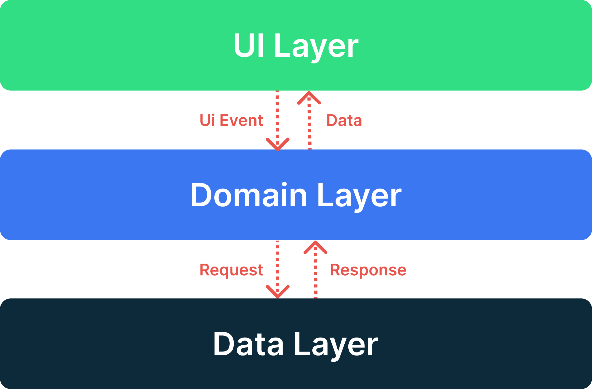
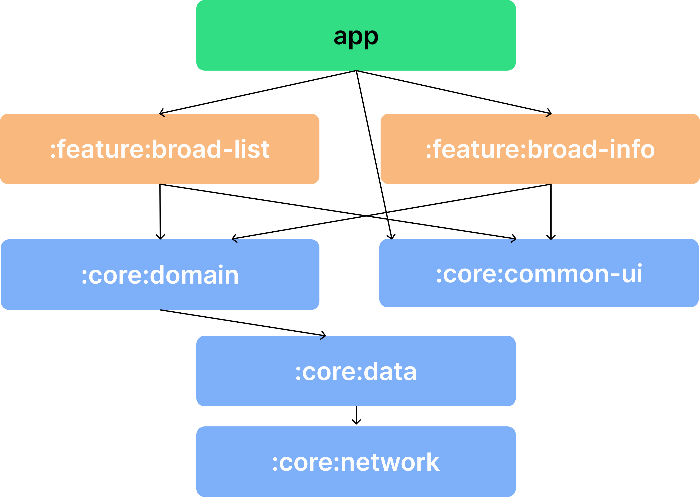

### AFTest – 박정근

## 프로젝트 스펙
- 언어: Kotlin
- 아키텍처: AAC ViewModel (VM + Databinding)
- 라이브러리
     - UI: RecyclerView, Navigation Component, ViewPager2, 
     - 비동기처리: Coroutine
     - 네트워킹: Retrofit2, OkHttp3
     - 이미지 로더: Glide
     - 의존성 주입: Hilt

<br/>

## 성능 최적화를 고려한 경우
- async없이 Coroutine을 통해 각 Category별 borads를 호출하게될 경우 평균적으로 295.66ms가 나왔지만 async를 통한 병렬처리로 인해 평균 154.5ms로 걸리는 시간을 단축하였습니다.
```kotlin
// 코루틴 병렬처리를 통한 시간속도 향상 - 병렬처리 X: 평균 295.66ms / 병렬처리: 평균 154.5ms
async {
    getBroadListUseCase(data.cateNo).collectLatest {
        categoryBroadsDataList[i] =
            CategoryBroads(
                data.cateNo,
                data.cateName,
                it.data ?: BroadList.EMPTY
            )

            count += 1

            if (count == randomCategories.size) {
                _categoryBroads.value = UiState.Success(categoryBroadsDataList)
            }
    }
}
```

- 무한 스크롤을 통해 이미지 로딩이 진행될 경우 썸네일이 바로 나타나는 것보다 부드러운 애니메이션이 적용되는 것이 UX에 좋다고 생각했습니다.
```kotlin
Glide.with(context)
    .load(url)
    .transition(DrawableTransitionOptions.withCrossFade())
    .into(this)
```

- 또한 무한스크롤 시 preload를 통해 화면 밖의 데이터의 이미지를 캐쉬처리하여 빠른 로딩이 가능하게끔 처리했습니다.
```kotlin
private fun imagePreload(position: Int) {
    if (position <= itemCount) {
        val endPosition = if (position + ITEM_PRELOAD_CNT > itemCount) {
            itemCount
        } else {
            position + ITEM_PRELOAD_CNT
        }
        currentList.subList(position, endPosition).map { it.broadThumb }.forEach {
            Glide.with(context).load(it).preload()
        }

        currentList.subList(position, endPosition).map { it.profileImg }.forEach {
            Glide.with(context).load(it).preload()
        }
    }
}
````

## Architecture
앱 아키텍처는 3개의 layer를 가지고 있습니다: Data Layer, Domain Layer, UI Layer



<br/>

## Modularization

